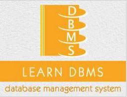

```
Roberto Nogueira  
BSd EE, MSd CE
Solution Integrator Experienced - Certified by Ericsson
```
# Tutorialspoint SQL Overview



**About This Tutorial**

This is to grasp rapidly the language and its concepts.

[C++ Tutorial](https://www.tutorialspoint.com/cplusplus/index.htm)

#### Topics
```
DBMS Tutorial
[ ] Home
[ ] Overview
[ ] Architecture
[ ] Data Models
[ ] Data Schemas
[ ] Data Independence
Entity Relationship Model
[ ] ER Model Basic Concepts
[ ] ER Diagram Representation
[ ] Generalization, Aggregation
Relational Model
[ ] Codd's Rules
[ ] Relational Data Model
[ ] Relational Algebra
[ ] ER to Relational Model
[ ] SQL Overview
Relational Database Desig
[ ] Database Normalizatio
[ ] Database Joins
Storage and File Structure
[ ] Storage System
[ ] File Structure
Indexing and Hashing
[ ] Indexing
[ ] Hashing
Transaction And Concurrency
[ ] Transaction
[ ] Concurrency Control
[ ] Deadlock
Backup and Recovery
[ ] Data Backup
[ ] Data Recovery
Useful Resources
[ ] Quick Guide
[ ] Useful Resources
[ ] Discussion
Selected Reading
[ ] Developer's Best Practices
[ ] Questions and Answers
[ ] Effective Resume Writing
[ ] HR Interview Questions
[ ] Computer Glossary
[ ] Who is Who
```

